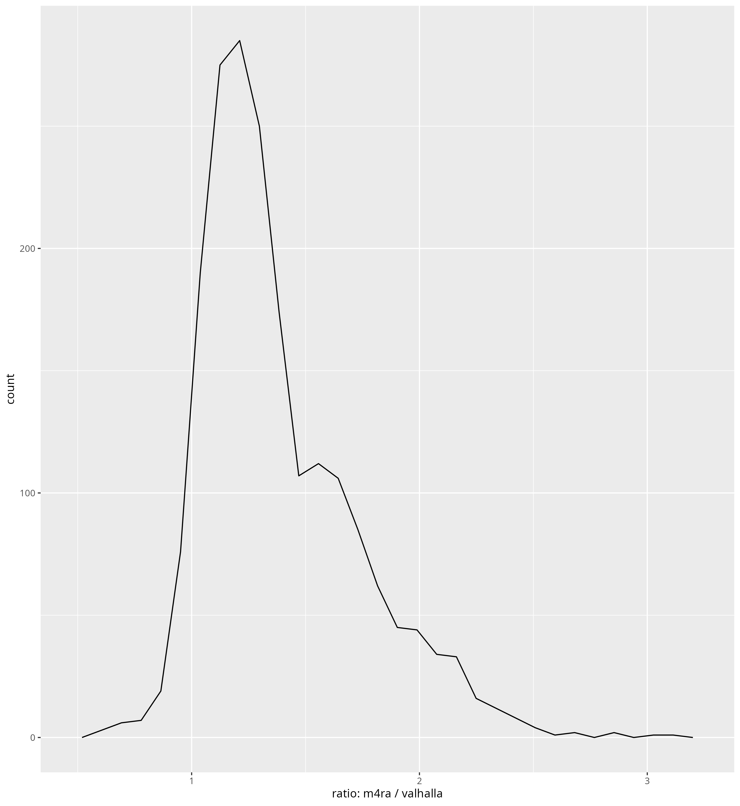

[](https://github.com/UrbanAnalyst/uta-engine/actions?query=workflow%3AR-CMD-check)
[](https://app.codecov.io/gh/UrbanAnalyst/uta-engine)
[](https://www.repostatus.org/#concept)

# UTA Engine

Routing and aggregation engine for ‘Urban Transport Analyst’

## Why?

Urban Transport Analyst aims to be the fastest and most scalable open
source multi-modal routing engine. Other notable options include:

1.  [“valhalla”, for single-mode
    routing](https://github.com/valhalla/valhalla)
2.  [“r5” for multi-modal routing](https://github.com/conveyal/r5)

### Benchmarks

The following benchmarks were generated by running a local docker image
of the `valhalla` engine. First generate some origin and destination
coordinates. Note that `valhalla` queries are limited to a total of
2,000 pairwise comparisons, whereas `m4ra` is only limited by memory,
and will generally extend to millions if not billions of comparisons.

``` r
city <- "mannheim"
mode <- "motorcar"
nsources <- 10L
ntargets <- 200L

graph <- m4ra::m4ra_load_cached_network (city = "mannheim", mode = "motorcar", contracted = TRUE)
v <- m4ra::m4ra_vertices (graph, city)
vxy <- data.frame (lat = v$y, lon = v$x)
set.seed (1L)
index_s <- sample (nrow (v), nsources)
index_t <- sample (nrow (v), ntargets)
sources <- vxy [index_s, ]
targets <- vxy [index_t, ]

from <- v$id [index_s]
to <- v$id [index_t]
```

`valhalla` then needs the source and target data converted to a list,
along with a specified “costing”, in this case as automobile.

``` r
dat <- list (
    sources = sources,
    targets = targets,
    costing = "auto"
)
```

A `valhalla` query is performed as a HTTP request to the server running
in the docker container. This function defines the request as a single
function:

``` r
valhalla <- function (dat) {
    q <- httr2::request ("http://localhost:8002/sources_to_targets") |>
        httr2::req_method ("POST") |>
        httr2::req_body_json (data = dat) |>
        httr2::req_perform ()
    httr2::resp_body_json (q, simplifyVector = TRUE)
}
```

That suffices to generate the benchmark comparisons:

``` r
bench::mark (
    valhalla = valhalla (dat),
    m4ra = m4ra::m4ra_times_single_mode (graph, from = from, to = to),
    check = FALSE
) [, 1:5]
```

    ## # A tibble: 2 × 5
    ##   expression      min   median `itr/sec` mem_alloc
    ##   <bch:expr> <bch:tm> <bch:tm>     <dbl> <bch:byt>
    ## 1 valhalla      2.52s    2.52s     0.397    3.55MB
    ## 2 m4ra       767.77ms 767.77ms     1.30    70.84MB

And `m4ra` is around three times faster than `valhalla`. Moreover,
`m4ra` is optimised for very large many-to-many queries, and so
generally performs larger queries even more efficiently. These can’t be
benchmarked against `valhalla` because of the intrinsic restriction to
small queries of 2,000 or less origin/destination pairs.

### Accuracy of estimated motorcar travel times

Automobile travel times in `m4ra` are calibrated using a [separate
empirical procedure](https://github.com/UrbanAnalyst/ttcalib) to ensure
realistic travel times are generated, and not just “optimal” travel
times reflecting unhibited travel at maximum permissible speed limits
along all ways.



The `m4ra` times are considerably slower than the “optimal” `valhalla`
times, with `m4ra` times being on average 38% slower. Perhaps more
importantly, the distribution is highly skewed, indicating that `m4ra`
clearly generates a few travel times far greater than equivalent
`valhalla` times. The `m4ra` calibration procedure attempts to capture
realistic effects of congestion on actual travel times, and this skewed
distribution is precisely what would be expected if `m4ra` indeeds
captures congestion effects which are not reflected in equivalent
`valhalla` times.
